# Car Price Prediction using Machine Learning


---

# Project Overview

The **Car Price Prediction using Machine Learning** project predicts the selling price of used cars based on various vehicle attributes such as car brand, manufacturing year, present price, kilometers driven, fuel type, transmission type, selling type, and number of previous owners.

This project demonstrates a complete **Machine Learning Regression Pipeline**, starting from data preprocessing to model deployment. Multiple regression models are trained and compared, with the best-performing model selected based on evaluation metrics.

The project also includes data visualization, feature engineering, model evaluation, prediction, and model saving for future use.

---

# Objectives

- Load and preprocess the car dataset.
- Explore the dataset using Exploratory Data Analysis (EDA).
- Clean and transform the data.
- Create new features for better prediction.
- Train multiple regression models.
- Compare model performance.
- Predict the selling price of used cars.
- Save the trained model.
- Visualize important insights.

---

# Dataset

## Dataset Source

https://www.kaggle.com/datasets/vijayaadithyanvg/car-price-predictionused-cars

Place the downloaded dataset inside the **dataset/** folder.

```
dataset/
    car data.csv
```

---

# Dataset Information

- **Dataset:** Used Car Price Dataset
- **Records:** 301 Cars
- **Features:** 8 Input Features
- **Target Variable:** Selling_Price

## Features

| Feature | Description |
|----------|-------------|
| Car_Name | Name of the Car |
| Year | Manufacturing Year |
| Present_Price | Current Ex-showroom Price |
| Driven_kms | Distance Driven |
| Fuel_Type | Petrol / Diesel / CNG |
| Selling_type | Dealer / Individual |
| Transmission | Manual / Automatic |
| Owner | Previous Owners |

### Target

Selling_Price

---

# Technologies Used

- Python
- Pandas
- NumPy
- Matplotlib
- Seaborn
- Scikit-learn
- Joblib
- Jupyter Notebook
- Visual Studio Code
- Git
- GitHub

---

# Project Structure

```
Car-Price-Prediction/
│
├── dataset/
│   └── car data.csv
│
├── images/
│   ├── architecture.png
│   ├── workflow.png
│   ├── dataset_preview.png
│   ├── price_distribution.png
│   ├── boxplot.png
│   ├── correlation_heatmap.png
│   ├── brand_analysis.png
│   ├── fuel_type.png
│   ├── transmission.png
│   ├── owner_distribution.png
│   ├── car_age_distribution.png
│   ├── feature_importance.png
│   ├── actual_vs_predicted.png
│   ├── residual_plot.png
│   ├── prediction_output.png
│   └── terminal_output.png
│
├── models/
│   └── car_price_model.pkl
│
├── notebooks/
│   └── car_price_prediction.ipynb
│
├── src/
│   ├── data_preprocessing.py
│   ├── visualization.py
│   ├── model_training.py
│   ├── evaluation.py
│   ├── prediction.py
│   └── main.py
│
├── requirements.txt
├── README.md
├── LICENSE
└── .gitignore
```

---

# Installation

## Clone the Repository

```bash
git clone https://github.com/ManjuVenkataBhargavDokku/Car-Price-Prediction.git
```

## Navigate to the Project

```bash
cd Car-Price-Prediction
```

## Install Dependencies

```bash
pip install -r requirements.txt
```

## Run the Project

```bash
cd src

python main.py
```

---

# Project Workflow

```
Download Dataset
        │
        ▼
Load Dataset
        │
        ▼
Data Cleaning
        │
        ▼
Feature Engineering
(Create Car Age)
        │
        ▼
Label Encoding
        │
        ▼
Exploratory Data Analysis
        │
        ▼
Data Visualization
        │
        ▼
Train-Test Split
        │
        ▼
Train Machine Learning Models
        │
        ▼
Model Evaluation
        │
        ▼
Compare Models
        │
        ▼
Select Best Model
        │
        ▼
Predict Selling Price
        │
        ▼
Save Trained Model
```

---

# Machine Learning Models

The following regression algorithms were implemented:

- Linear Regression
- Decision Tree Regressor
- Random Forest Regressor

The model with the highest **R² Score** is selected as the final prediction model.

---

# Evaluation Metrics

The regression models are evaluated using:

- R² Score
- Mean Absolute Error (MAE)
- Mean Squared Error (MSE)
- Root Mean Squared Error (RMSE)

---

# Project Outputs

## Dataset Preview


---

## Price Distribution

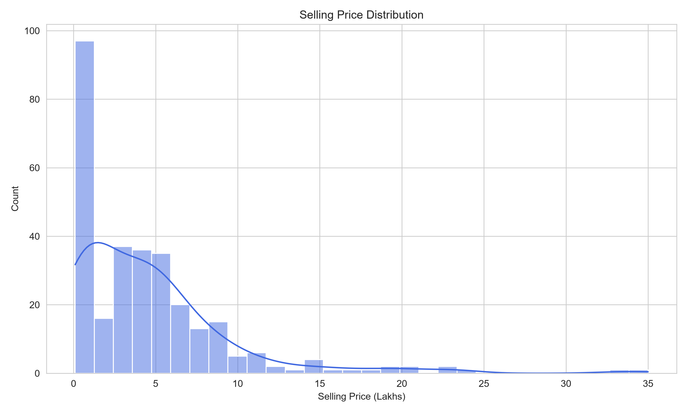

---

## Box Plot

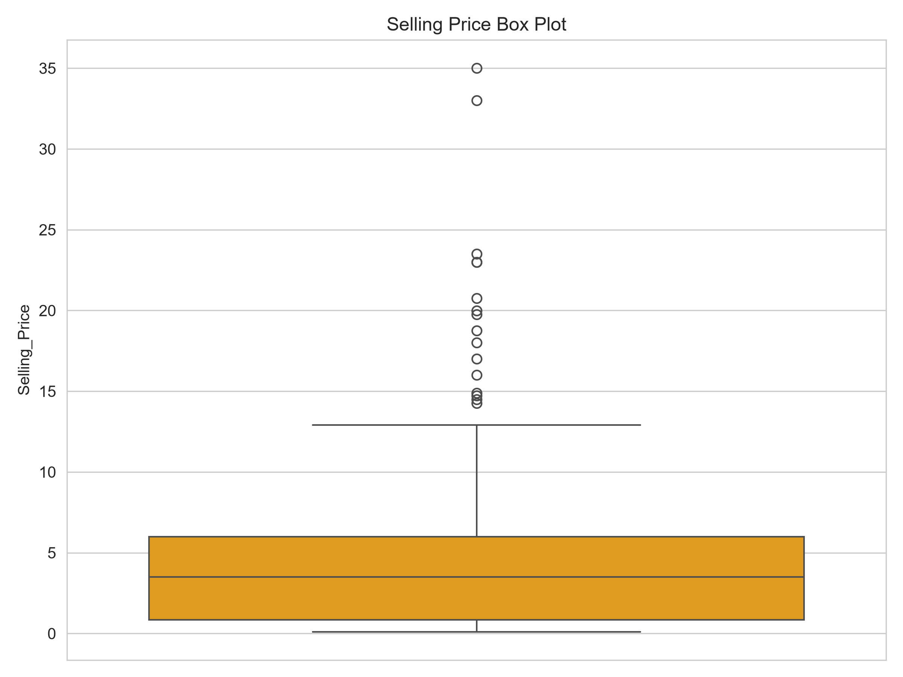

---

## Correlation Heatmap

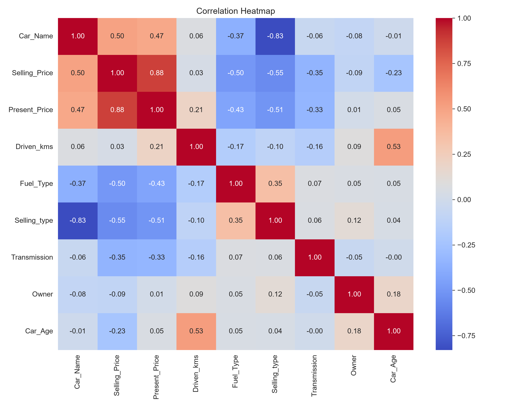

---

## Brand Analysis

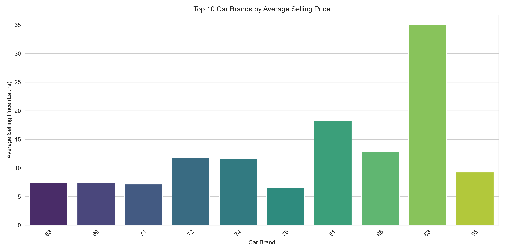

---

## Fuel Type Distribution

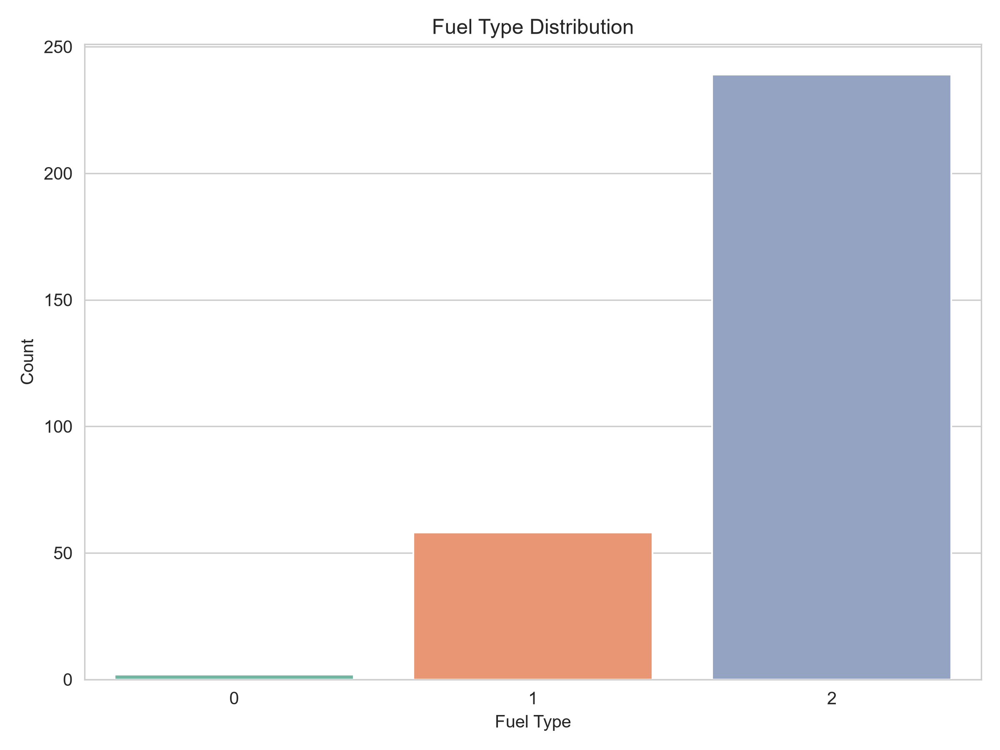

---

## Transmission Distribution

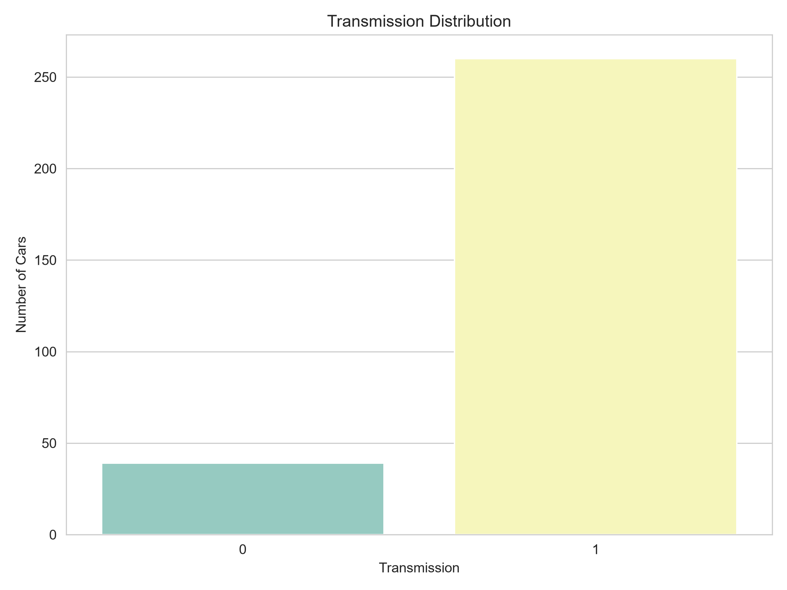

---

## Owner Distribution

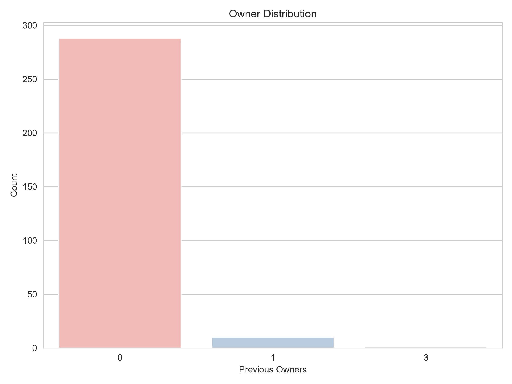

---

## Car Age Distribution

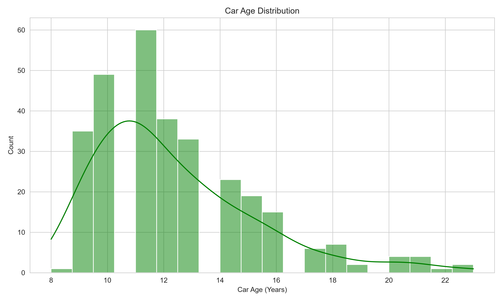

---

## Feature Importance

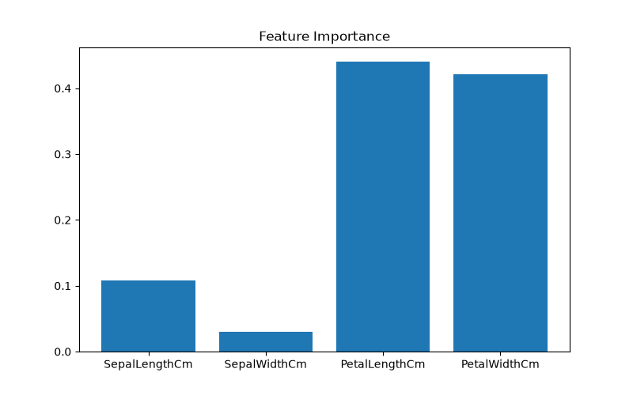

---

## Actual vs Predicted Prices

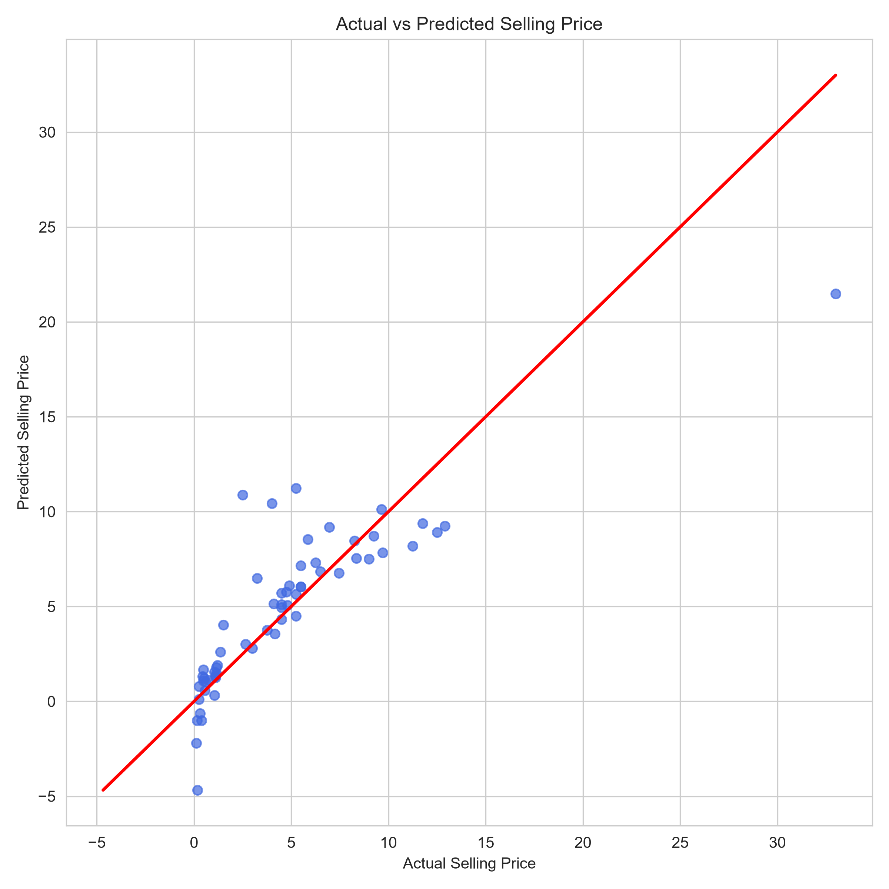

---

## Residual Plot

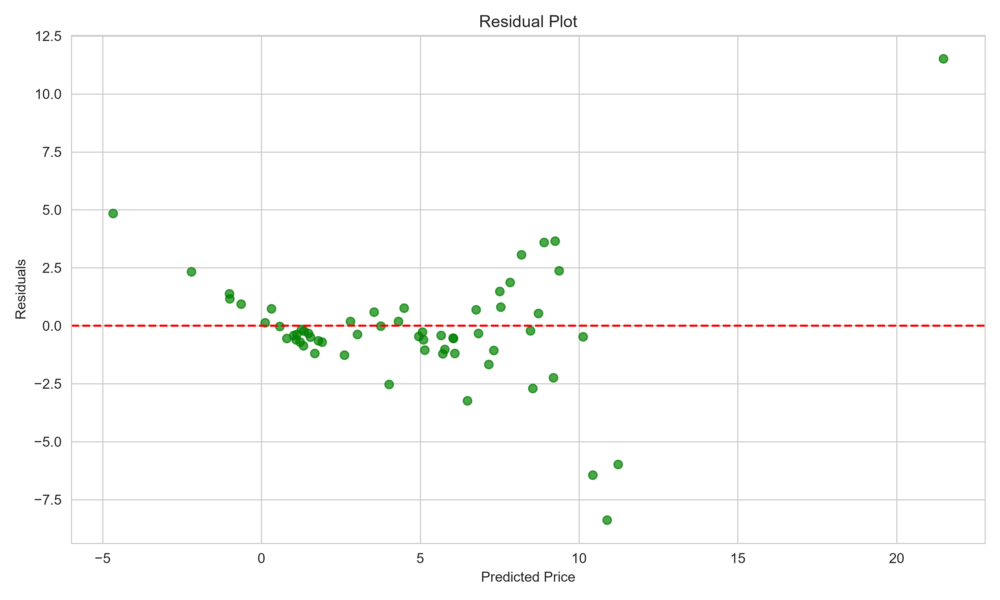

---

## Workflow Diagram

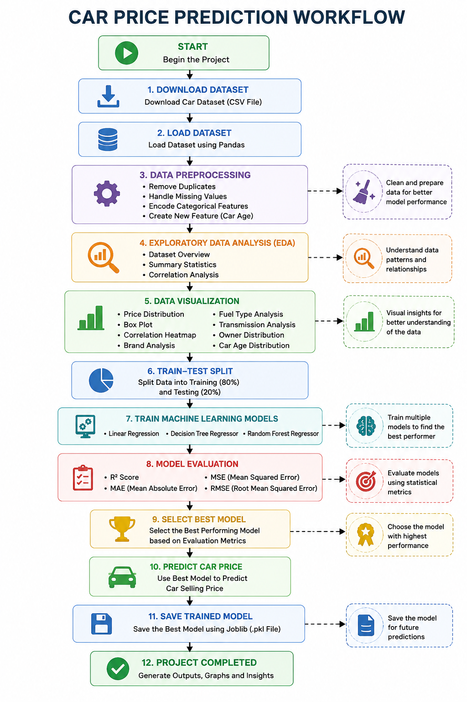

---

## System Architecture

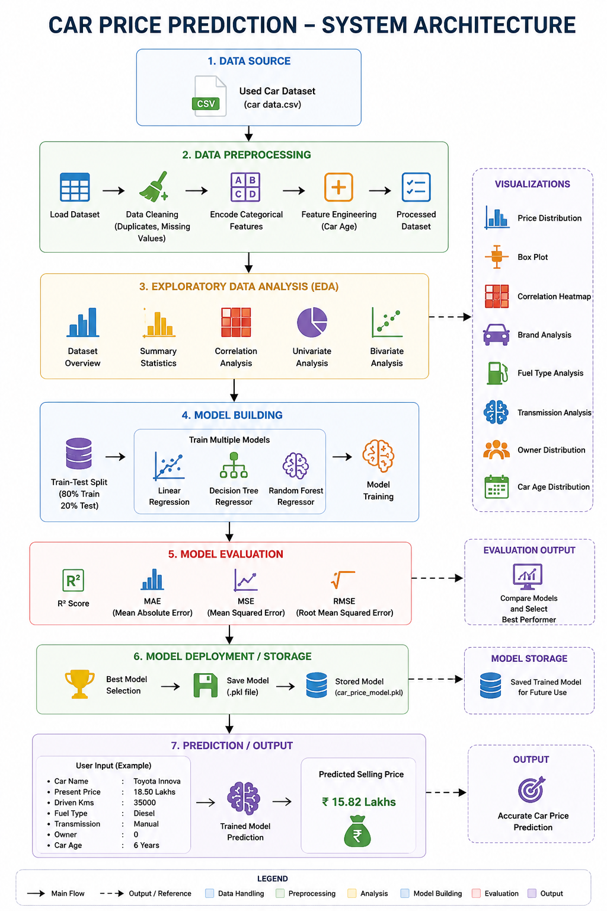

---


# Sample Prediction

### Sample Input

| Feature | Value |
|----------|-------|
| Car Name | Toyota Innova |
| Present Price | 18.50 Lakhs |
| Driven Kms | 35,000 |
| Fuel Type | Diesel |
| Transmission | Manual |
| Owner | 0 |
| Car Age | 6 Years |

### Predicted Output

```
Predicted Selling Price

₹15.82 Lakhs
```

---

# Future Enhancements

- Hyperparameter tuning using GridSearchCV.
- Deploy the model using Flask.
- Build an interactive Streamlit web application.
- Compare additional regression algorithms.
- Integrate real-time market data.
- Deploy the project on Render or Hugging Face Spaces.
- Add a user-friendly web interface.

---

# Learning Outcomes

This project provides practical experience in:

- Data Cleaning
- Data Preprocessing
- Feature Engineering
- Exploratory Data Analysis
- Data Visualization
- Regression Algorithms
- Model Evaluation
- Feature Importance Analysis
- Saving and Loading Models
- End-to-End Machine Learning Workflow
- Git & GitHub Project Management

---

# Contributing

Contributions are welcome.

1. Fork the repository.
2. Create a feature branch.
3. Commit your changes.
4. Push to your branch.
5. Open a Pull Request.

---

# License

This project is licensed under the MIT License.

---

# Author

## Manju Venkata Bhargav Dokku

**CodeAlpha Data Science Internship**

---

**If you found this project useful, consider giving it a Star on GitHub!**