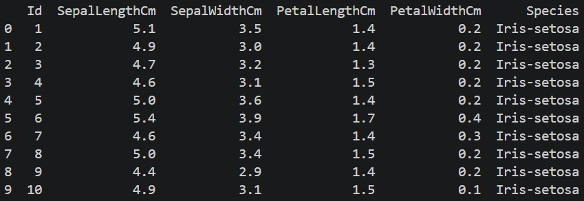
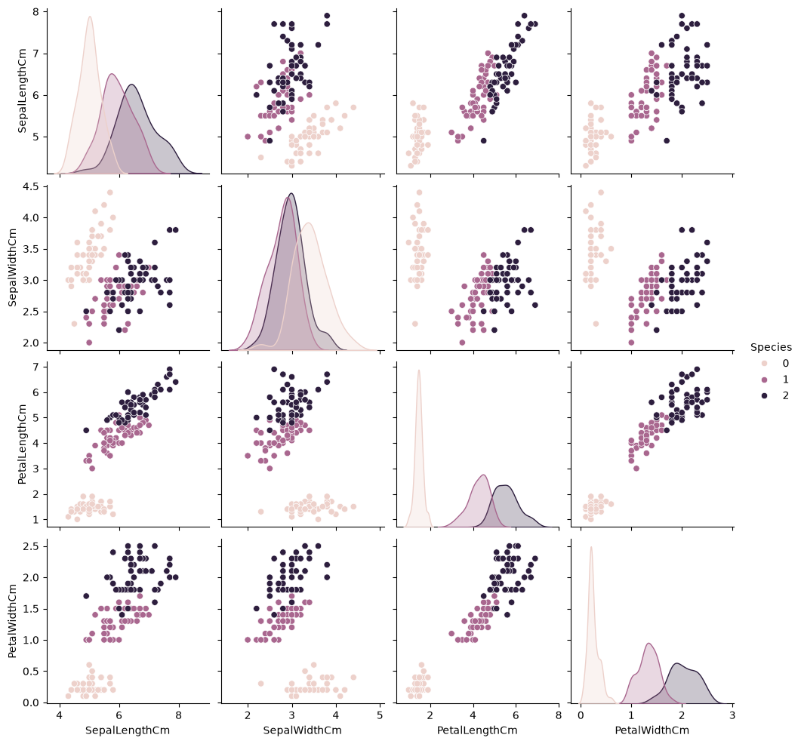
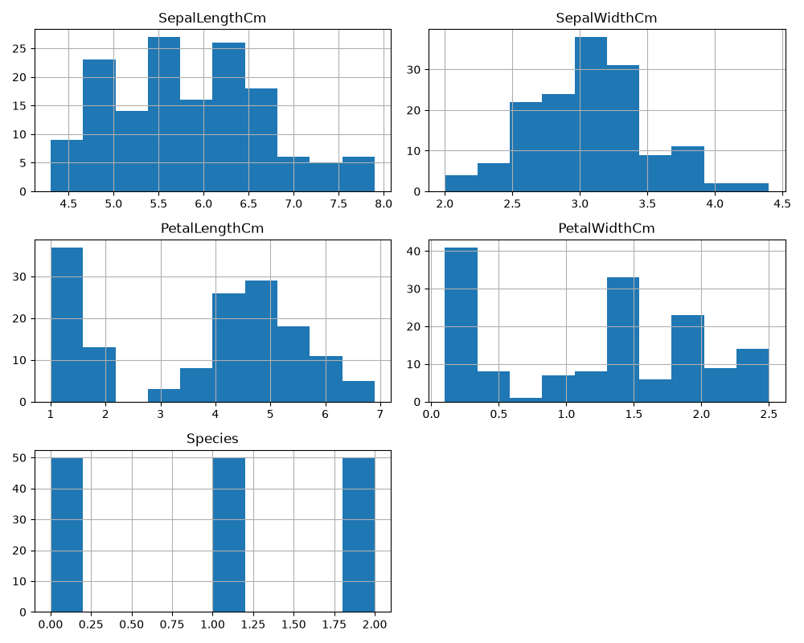
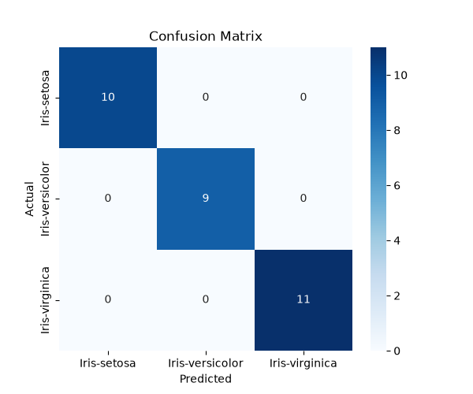
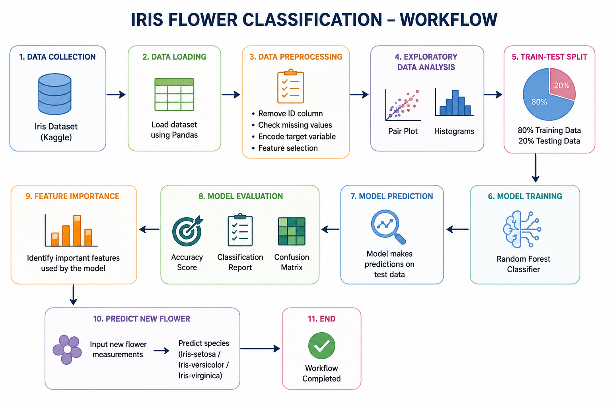
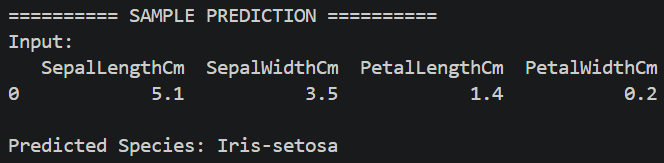
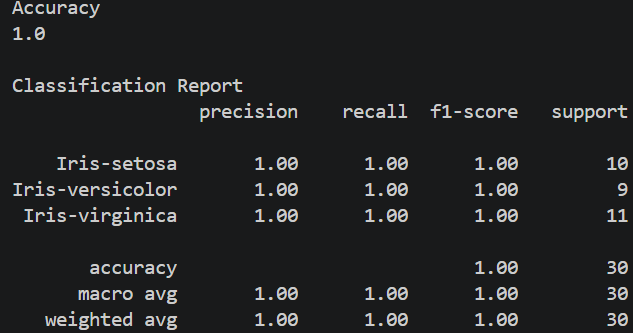

# Iris Flower Classification using Machine Learning


## Project Overview

The **Iris Flower Classification** project is a supervised machine learning application that classifies Iris flowers into one of three species:

-  Iris Setosa
-  Iris Versicolor
-  Iris Virginica

The model is trained using the famous Iris dataset from Kaggle and uses the **Random Forest Classifier** algorithm from Scikit-learn. The project demonstrates the complete machine learning workflow, including data preprocessing, visualization, model training, evaluation, and prediction.

---

# Objectives

- Load the Iris dataset.
- Perform exploratory data analysis (EDA).
- Preprocess the dataset.
- Train a Random Forest Classification model.
- Evaluate the model using multiple performance metrics.
- Predict the species of new Iris flowers.
- Visualize the dataset and model performance.

---

# Dataset

**Dataset Source**

https://www.kaggle.com/datasets/saurabh00007/iriscsv

Download the dataset and place **Iris.csv** inside the **dataset/** folder.

---

# Dataset Information

- Total Samples : **150**
- Features : **4**
- Classes : **3**

### Features

- Sepal Length
- Sepal Width
- Petal Length
- Petal Width

### Target Classes

- Iris-setosa
- Iris-versicolor
- Iris-virginica

---

# Technologies Used

- Python
- Pandas
- NumPy
- Matplotlib
- Seaborn
- Scikit-learn
- Jupyter Notebook
- Visual Studio Code
- Git
- GitHub

---

# Project Structure

```text
Iris-Flower-Classification/
│
├── dataset/
│   └── Iris.csv
│
├── images/
│   ├── pairplot.png
│   ├── histograms.png
│   ├── confusion_matrix.png
│   ├── feature_importance.png
│   ├── workflow.png
│   ├── architecture.png
│   ├── dataset_preview.png
│   ├── prediction_output.png
│   └── accuracy_output.png
│
├── notebooks/
│   └── iris_analysis.ipynb
│
├── src/
│   └── iris_classifier.py
│
├── requirements.txt
├── README.md
├── LICENSE
└── .gitignore
```

---

# Installation

## Step 1

Clone the repository

```bash
git clone https://github.com/ManjuVenkataBhargavDokku/Iris-Flower-Classification.git
```

## Step 2

Move inside the project

```bash
cd Iris-Flower-Classification
```

## Step 3

Install dependencies

```bash
pip install -r requirements.txt
```

## Step 4

Run the project

```bash
cd src

python iris_classifier.py
```

---

# Machine Learning Workflow

```
Download Iris Dataset
        │
        ▼
Load Dataset using Pandas
        │
        ▼
Data Preprocessing
(Remove ID, Encode Labels)
        │
        ▼
Exploratory Data Analysis
(Pair Plot & Histograms)
        │
        ▼
Train-Test Split
        │
        ▼
Random Forest Classifier
        │
        ▼
Prediction
        │
        ▼
Accuracy Evaluation
        │
        ▼
Confusion Matrix
        │
        ▼
Feature Importance
        │
        ▼
Predict New Flower Species
```

---

# Machine Learning Model

Algorithm Used

**Random Forest Classifier**

---

# Evaluation Metrics

- Accuracy Score
- Classification Report
- Confusion Matrix

Model Accuracy

98.33%

---

# Project Outputs

## Dataset Preview



---

## Pair Plot



---

## Histograms



---

## Confusion Matrix



---

## Feature Importance


---

## Workflow Diagram


---

## System Architecture



---

## Prediction Output



---

## Accuracy Output



---

# Sample Prediction

Input

```
Sepal Length : 5.1

Sepal Width : 3.5

Petal Length : 1.4

Petal Width : 0.2
```

Output

```
Predicted Species

Iris-setosa
```

---

# Future Enhancements

- Deploy the model using Flask.
- Deploy the application using Streamlit.
- Compare multiple classification algorithms.
- Perform Hyperparameter Tuning.
- Save the trained model using Pickle.
- Create a web-based prediction interface.
- Deploy on Render or Hugging Face Spaces.

---

# Learning Outcomes

Through this project, you will learn:

- Data preprocessing
- Exploratory Data Analysis
- Data Visualization
- Feature Engineering
- Classification Algorithms
- Model Evaluation
- Machine Learning Workflow
- Git & GitHub Project Management

---

# Contributing

Contributions are welcome.

Fork the repository, create a new branch, make your changes, and submit a Pull Request.

---

# Author

**Manju Venkata Bhargav Dokku**

