# Sales Prediction using Machine Learning


---

# Project Overview

The **Sales Prediction using Machine Learning** project predicts product sales based on advertising expenditure across different marketing channels such as **TV**, **Radio**, and **Newspaper**.

The project demonstrates a complete machine learning workflow, including:

- Data Collection
- Data Preprocessing
- Exploratory Data Analysis (EDA)
- Data Visualization
- Model Training
- Model Evaluation
- Sales Prediction
- Business Insights

The project uses multiple regression algorithms to predict future sales and compares their performance to select the best-performing model.

---

# Objectives

- Load and preprocess advertising dataset
- Perform Exploratory Data Analysis (EDA)
- Visualize advertising trends
- Train multiple regression models
- Compare model performance
- Predict future sales
- Evaluate model accuracy
- Save the trained model
- Generate actionable business insights

---

# Dataset

## Dataset Source

https://www.kaggle.com/datasets/bumba5341/advertisingcsv

Download the dataset and place:

```
Advertising.csv
```

inside the **dataset/** folder.

---

# Dataset Information

- Total Records : **200**
- Features : **3**
- Target Variable : **Sales**

### Input Features

- TV Advertising Budget
- Radio Advertising Budget
- Newspaper Advertising Budget

### Target

- Product Sales

---

# Technologies Used

- Python
- Pandas
- NumPy
- Matplotlib
- Seaborn
- Scikit-learn
- Joblib
- Jupyter Notebook
- Visual Studio Code
- Git
- GitHub

---

# Project Structure

```text
Sales-Prediction/
│
├── dataset/
│   └── Advertising.csv
│
├── images/
│   ├── architecture.png
│   ├── workflow.png
│   ├── dataset_preview.png
│   ├── sales_distribution.png
│   ├── correlation_heatmap.png
│   ├── tv_vs_sales.png
│   ├── radio_vs_sales.png
│   ├── newspaper_vs_sales.png
│   ├── feature_importance.png
│   ├── actual_vs_predicted.png
│   ├── residual_plot.png
│   ├── prediction_output.png
│   └── terminal_output.png
│
├── models/
│   └── sales_prediction_model.pkl
│
├── notebooks/
│   └── sales_prediction.ipynb
│
├── src/
│   ├── data_preprocessing.py
│   ├── visualization.py
│   ├── model_training.py
│   ├── evaluation.py
│   ├── prediction.py
│   └── main.py
│
├── requirements.txt
├── README.md
├── LICENSE
└── .gitignore
```

---

# Installation

## Step 1

Clone the repository

```bash
git clone https://github.com/ManjuVenkataBhargavDokku/Sales-Prediction.git
```

---

## Step 2

Move into the project directory

```bash
cd Sales-Prediction
```

---

## Step 3

Create a Virtual Environment

### Windows

```bash
python -m venv venv
```

Activate it

```bash
venv\Scripts\activate
```

---

## Step 4

Install Dependencies

```bash
pip install -r requirements.txt
```

---

## Step 5

Run the Project

```bash
cd src

python main.py
```

---

# Machine Learning Workflow

```
Download Advertising Dataset
            │
            ▼
Load Dataset using Pandas
            │
            ▼
Data Preprocessing
(Remove Duplicates & Check Missing Values)
            │
            ▼
Exploratory Data Analysis
            │
            ▼
Data Visualization
            │
            ▼
Train-Test Split
            │
            ▼
Train Regression Models
│
├── Linear Regression
├── Decision Tree Regressor
└── Random Forest Regressor
            │
            ▼
Model Evaluation
(R², MAE, MSE, RMSE)
            │
            ▼
Select Best Model
            │
            ▼
Feature Importance
            │
            ▼
Predict Sales
            │
            ▼
Save Model (.pkl)
            │
            ▼
Project Completed
```

---

# Machine Learning Models

The following regression algorithms are implemented:

- Linear Regression
- Decision Tree Regressor
- Random Forest Regressor

The best-performing model is automatically selected based on the **R² Score**.

---

# Evaluation Metrics

The trained models are evaluated using:

- R² Score
- Mean Absolute Error (MAE)
- Mean Squared Error (MSE)
- Root Mean Squared Error (RMSE)

---

# Project Outputs

## Dataset Preview

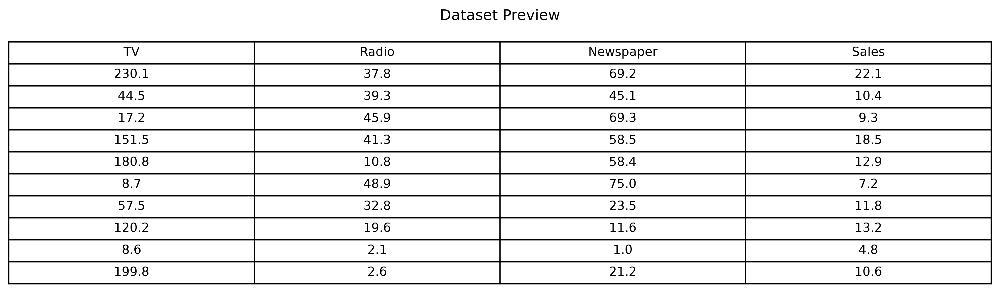

---

## Sales Distribution

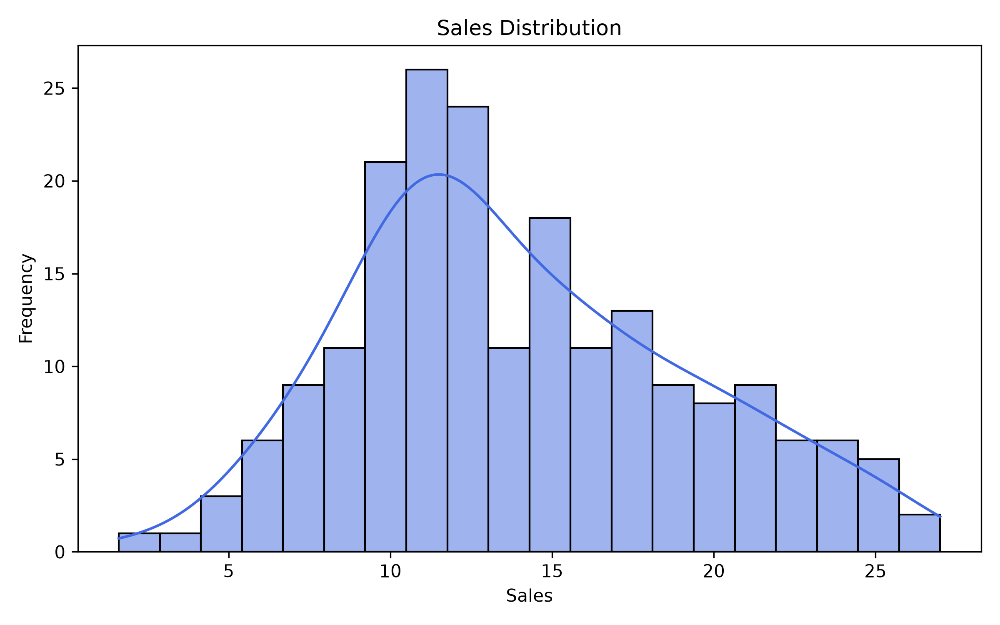

---

## Correlation Heatmap

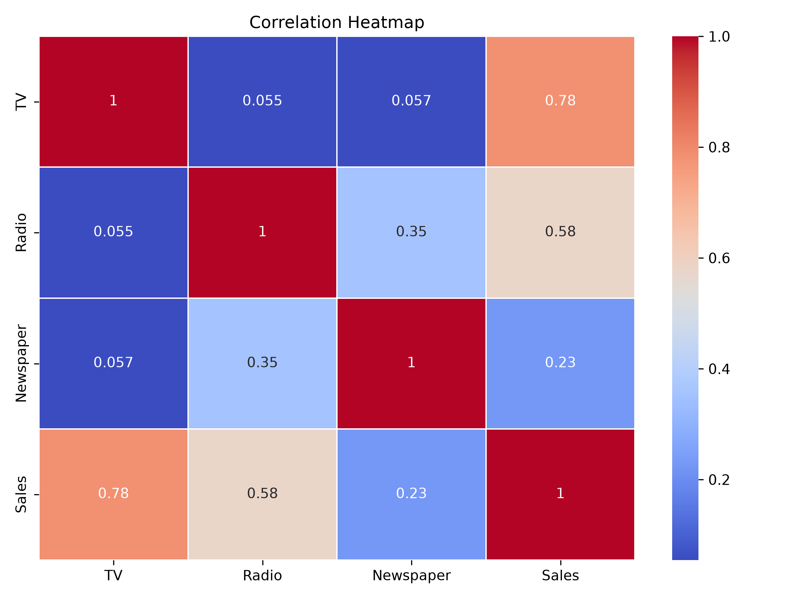

---

## TV Advertising vs Sales

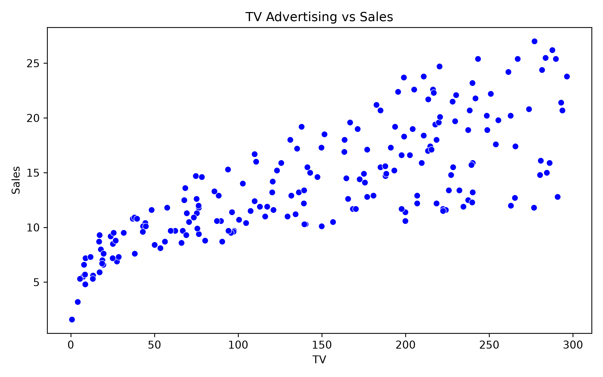

---

## Radio Advertising vs Sales

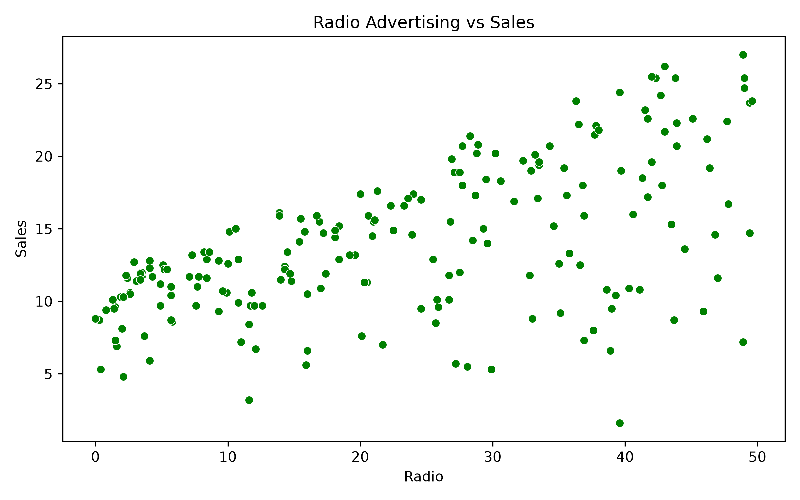

---

## Newspaper Advertising vs Sales

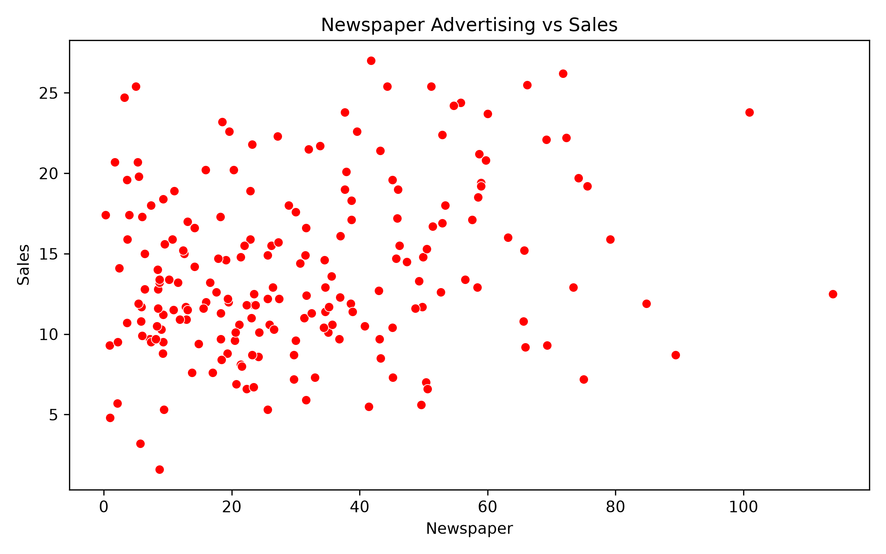

---

## Feature Importance

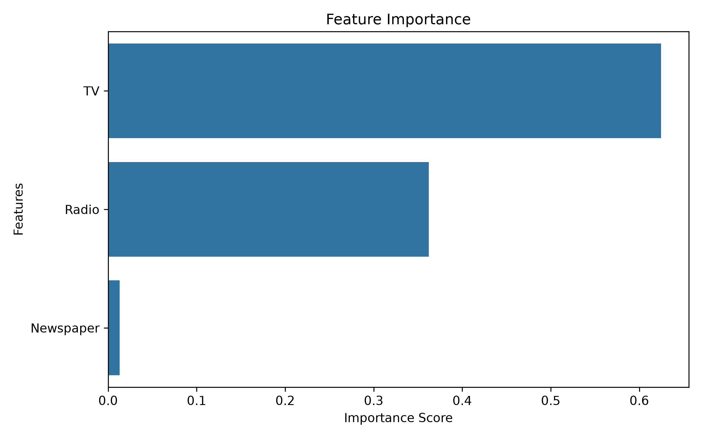

---

## Actual vs Predicted Sales

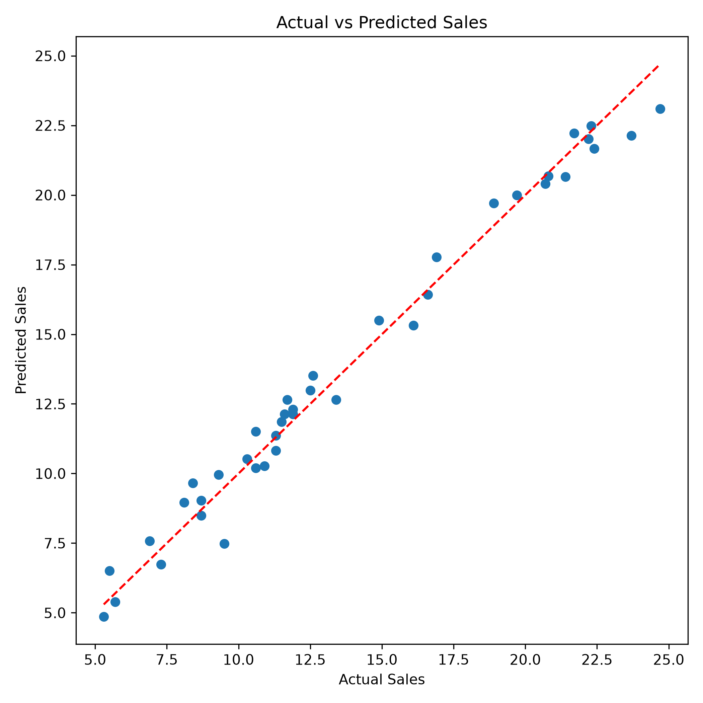

---

## Residual Plot

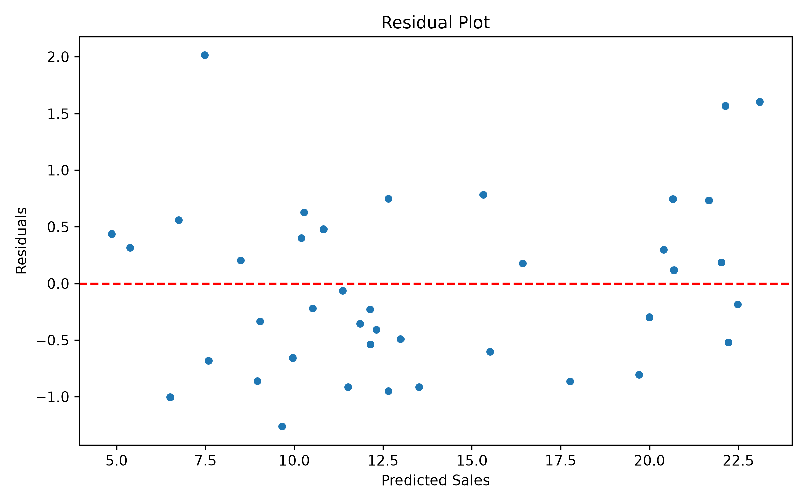

---

## Workflow Diagram

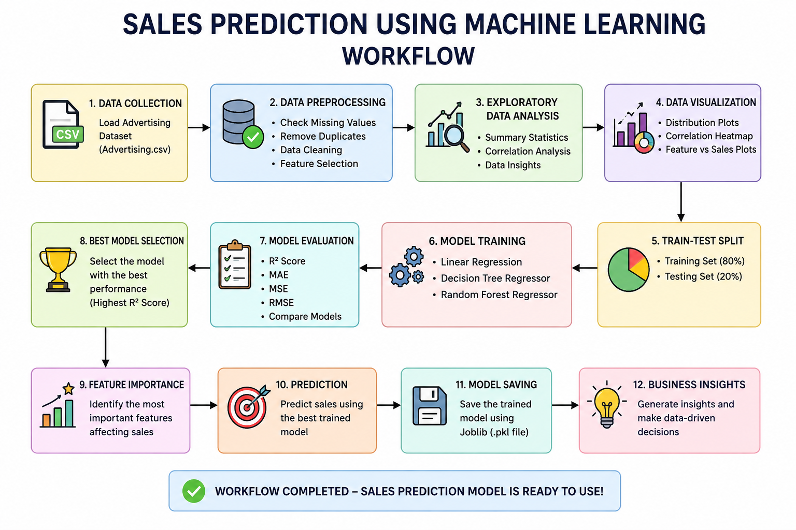

---

## System Architecture

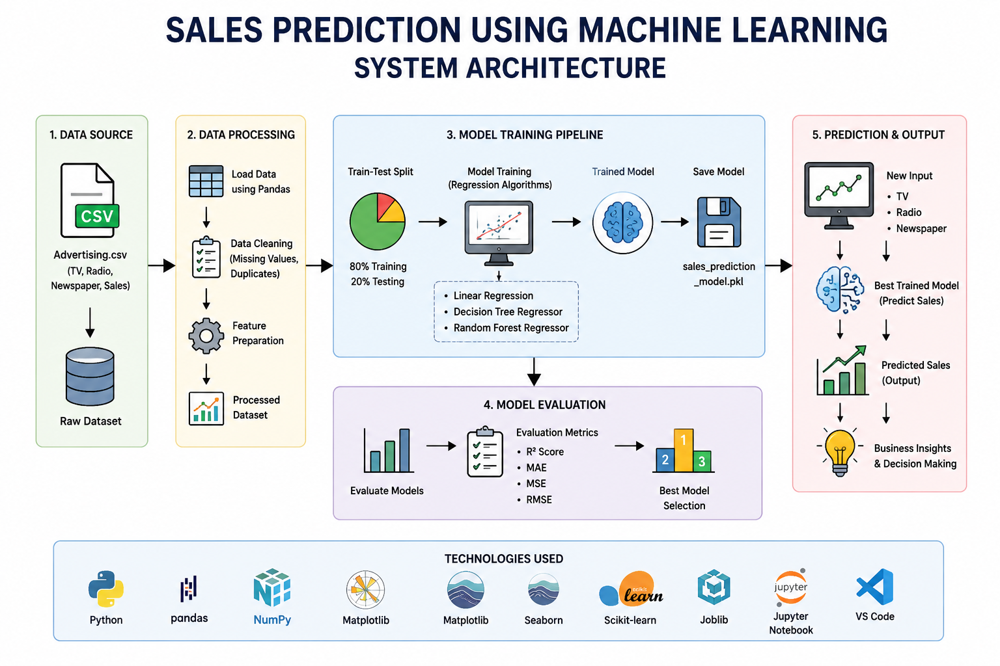

---

## Prediction Output

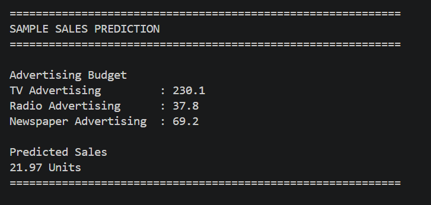

---

## Terminal Output

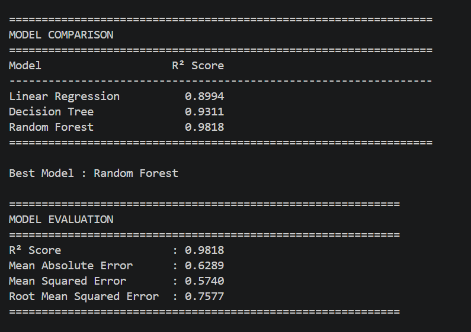

---

# Sample Prediction

### Input

```
TV Advertising Budget        : 230.1

Radio Advertising Budget     : 37.8

Newspaper Advertising Budget : 69.2
```

### Output

```
Predicted Sales

22.15 Units
```

---

# Business Insights

The project provides valuable insights into advertising effectiveness:

- TV advertising generally has the strongest influence on sales.
- Radio advertising positively contributes to sales.
- Newspaper advertising often has a smaller impact compared to TV and Radio.
- The trained model helps businesses estimate future sales before investing in advertising campaigns.

---

# Future Enhancements

- Deploy using Streamlit
- Build a Flask REST API
- Hyperparameter tuning
- Compare additional regression models
- Deploy on Render or Hugging Face Spaces
- Add interactive dashboard
- Real-time sales forecasting

---

# Learning Outcomes

Through this project, you will learn:

- Data Preprocessing
- Exploratory Data Analysis (EDA)
- Data Visualization
- Feature Engineering
- Regression Algorithms
- Model Evaluation
- Feature Importance
- Model Persistence using Joblib
- Git & GitHub Project Management

---

# Contributing

Contributions are welcome.

Fork the repository, create a new branch, make your changes, and submit a Pull Request.

---

# Author

**Manju Venkata Bhargav Dokku**

GitHub: https://github.com/ManjuVenkataBhargavDokku

---

# If you found this project useful, please consider giving it a star on GitHub!