# Unemployment Analysis with Python


---

# Project Overview

The **Unemployment Analysis with Python** project is a comprehensive data analysis application developed as part of the **CodeAlpha Data Science Internship**.

The project analyzes unemployment trends across different states in India using Python. It includes data preprocessing, exploratory data analysis (EDA), visualization of unemployment patterns, COVID-19 impact analysis, and generation of meaningful insights to understand employment trends.

The project demonstrates a complete data analysis workflow, making it suitable for beginners as well as those looking to understand real-world data analytics using Python.

---

# Objectives

- Load and clean the unemployment dataset.
- Handle missing values and duplicate records.
- Perform Exploratory Data Analysis (EDA).
- Analyze unemployment trends across Indian states.
- Study monthly and yearly unemployment patterns.
- Analyze the impact of COVID-19 on unemployment.
- Generate informative visualizations.
- Extract actionable insights from the dataset.

---

# Dataset

## Dataset Source

https://www.kaggle.com/datasets/gokulrajkmv/unemployment-in-india

### Dataset Used

```
Unemployment in India.csv
```

Place the dataset inside the **dataset/** folder before running the project.

---

# Dataset Information

The dataset contains unemployment statistics collected from various states in India.

### Features Included

- Region
- Date
- Frequency
- Estimated Unemployment Rate (%)
- Estimated Employed
- Estimated Labour Participation Rate (%)
- Area (Urban/Rural)

---

# Technologies Used

- Python
- Pandas
- NumPy
- Matplotlib
- Seaborn
- Jupyter Notebook
- Visual Studio Code
- Git
- GitHub

---

# Project Structure

```text
Unemployment-Analysis/
│
├── dataset/
│   └── Unemployment in India.csv
│
├── images/
│   ├── architecture.png
│   ├── workflow.png
│   ├── dataset_preview.png
│   ├── histogram.png
│   ├── boxplot.png
│   ├── state_unemployment.png
│   ├── monthly_trend.png
│   ├── covid_impact.png
│   ├── labour_participation.png
│   ├── heatmap.png
│   ├── correlation_matrix.png
│   ├── top10_states.png
│   ├── pie_chart.png
│   ├── yearly_trend.png
│   ├── prediction_output.png
│   └── terminal_output.png
│
├── notebooks/
│   └── unemployment_analysis.ipynb
│
├── src/
│   ├── main.py
│   ├── analysis.py
│   ├── data_cleaning.py
│   └── visualization.py
│
├── README.md
├── requirements.txt
├── LICENSE
└── .gitignore
```

---

# Installation

## Step 1

Clone the repository

```bash
git clone https://github.com/ManjuVenkataBhargavDokku/Unemployment_Analysis.git
```

---

## Step 2

Move into the project directory

```bash
cd Unemployment-Analysis
```

---

## Step 3

Create a Virtual Environment

### Windows

```bash
python -m venv venv
```

Activate the environment

```bash
venv\Scripts\activate
```

---

## Step 4

Install Dependencies

```bash
pip install -r requirements.txt
```

---

## Step 5

Run the Project

```bash
cd src

python main.py
```

---

# Project Workflow

```
Download Dataset
        │
        ▼
Load Dataset using Pandas
        │
        ▼
Data Cleaning
(Remove Missing Values & Duplicates)
        │
        ▼
Data Preprocessing
        │
        ▼
Exploratory Data Analysis
        │
        ▼
Generate Visualizations
        │
        ├── Histogram
        ├── Box Plot
        ├── Heatmap
        ├── Correlation Matrix
        ├── Monthly Trend
        ├── State-wise Analysis
        ├── COVID-19 Impact
        ├── Labour Participation
        └── Top 10 States
        │
        ▼
Generate Insights
        │
        ▼
Project Completed
```

---

# Analysis Performed

The project includes:

- Dataset Summary
- Missing Value Analysis
- Duplicate Record Detection
- Data Cleaning
- State-wise Unemployment Analysis
- Monthly Trend Analysis
- Yearly Trend Analysis
- COVID-19 Impact Analysis
- Correlation Analysis
- Labour Participation Analysis
- Top 10 States Analysis
- Urban vs Rural Analysis (if available)

---

# Visualizations Generated

The project automatically generates the following charts inside the **images/** folder:

- Dataset Preview
- Histogram
- Box Plot
- State-wise Unemployment Rate
- Monthly Trend Analysis
- COVID-19 Impact Analysis
- Labour Participation Rate
- Correlation Heatmap
- Correlation Matrix
- Top 10 States
- Pie Chart
- Year-wise Trend
- Workflow Diagram
- System Architecture

---

# Project Outputs

## Dataset Preview

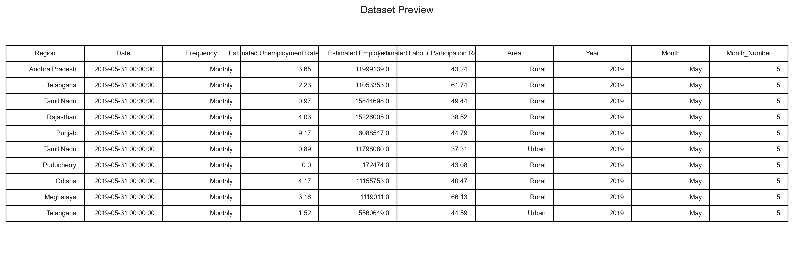

---

## Histogram

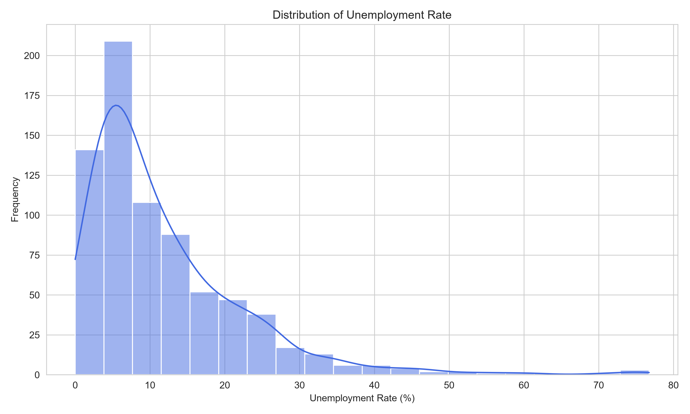

---

## Box Plot

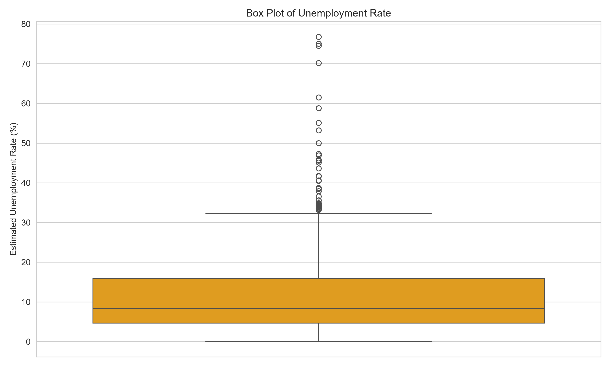

---

## State-wise Unemployment Rate

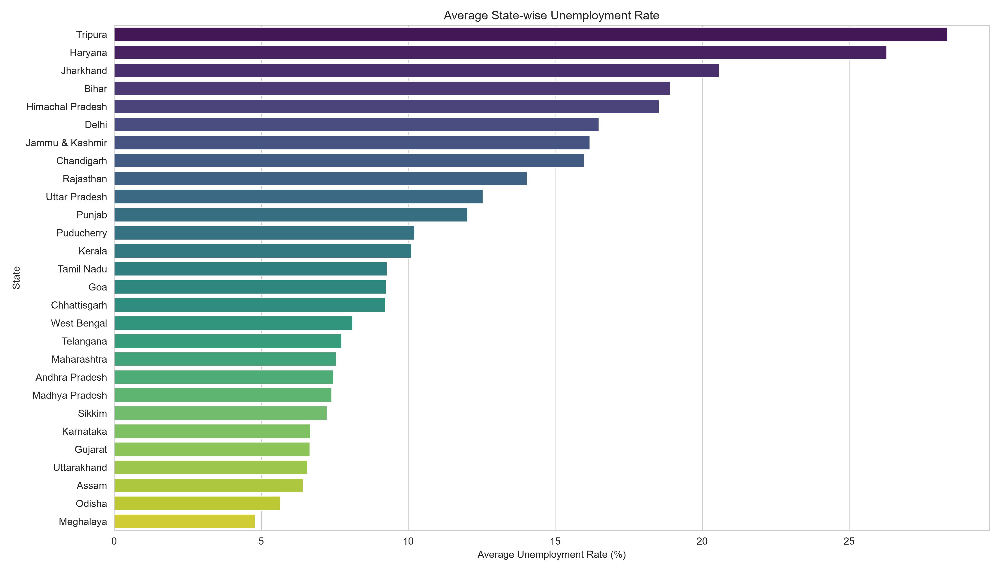

---

## Monthly Trend

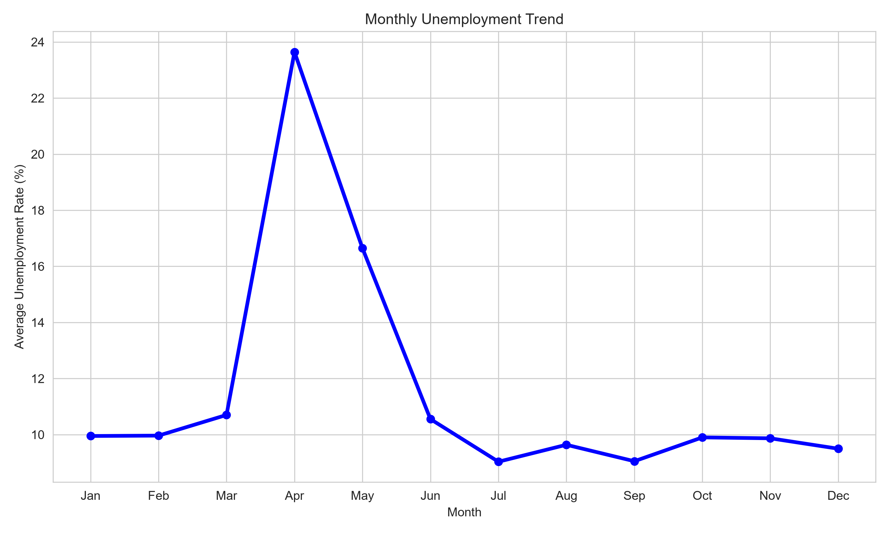

---

## COVID-19 Impact

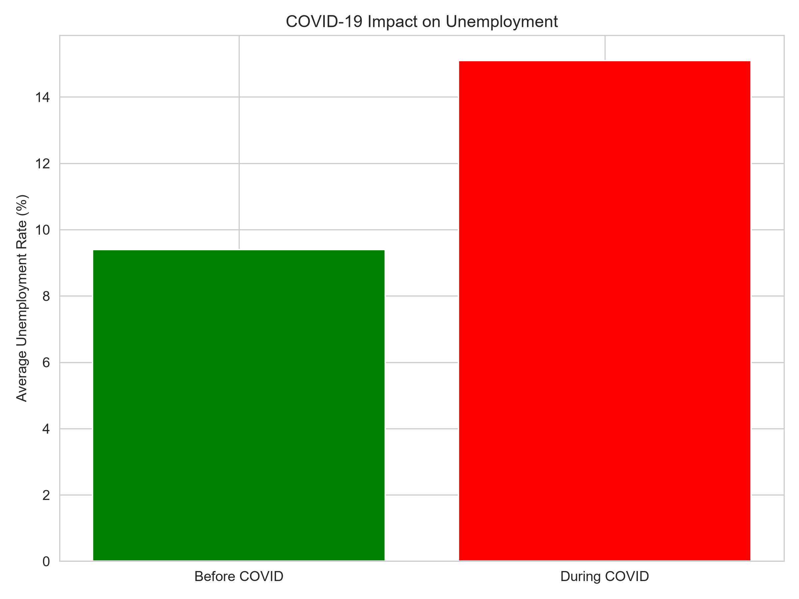

---

## Labour Participation Rate

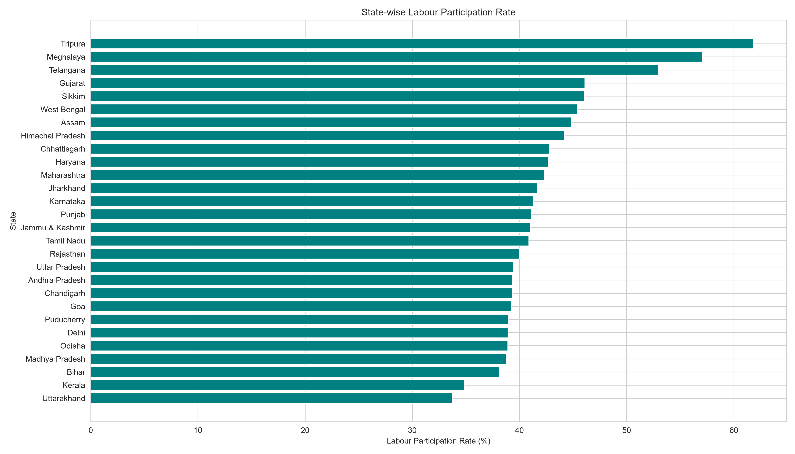

---

## Correlation Heatmap

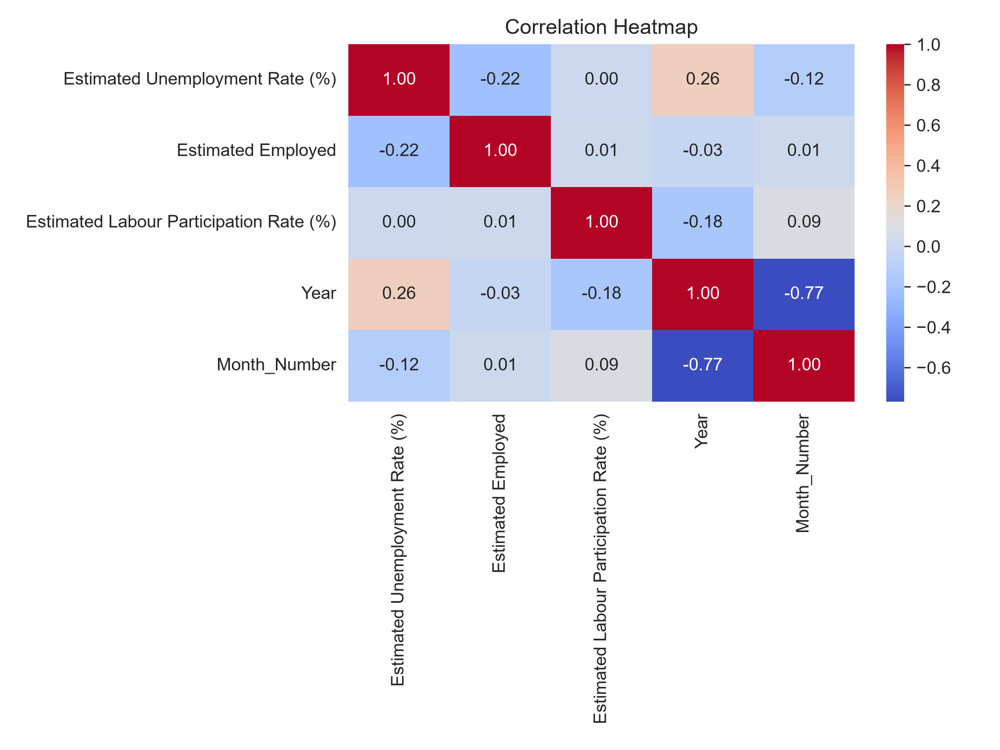

---

## Correlation Matrix

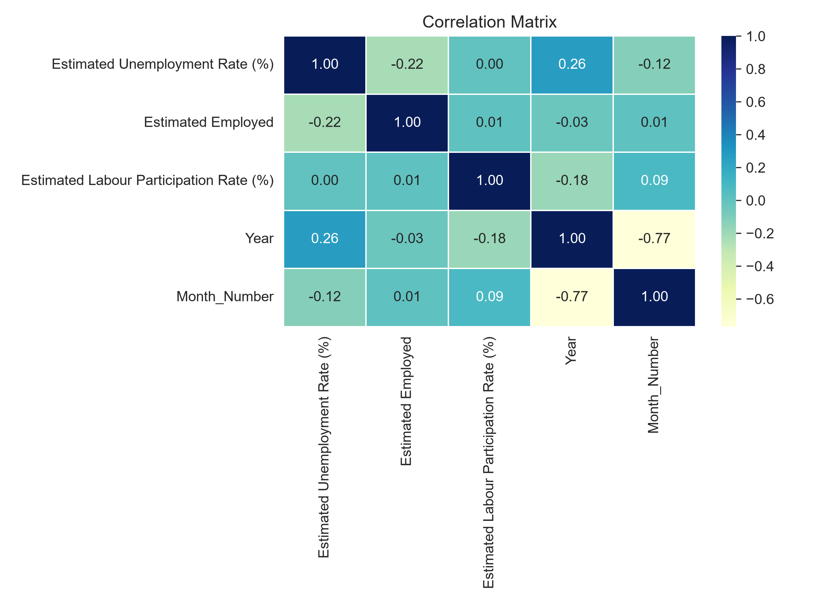

---

## Top 10 States

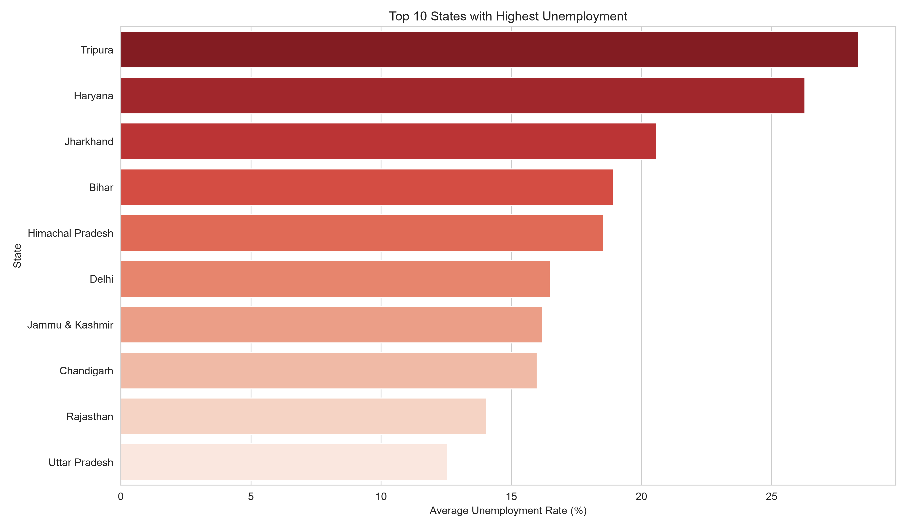

---

## Pie Chart

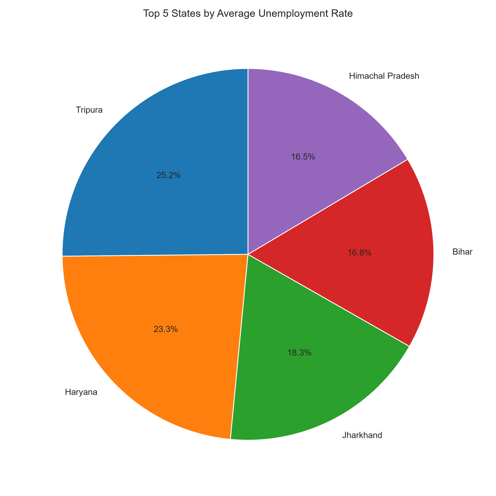

---

## Year-wise Trend

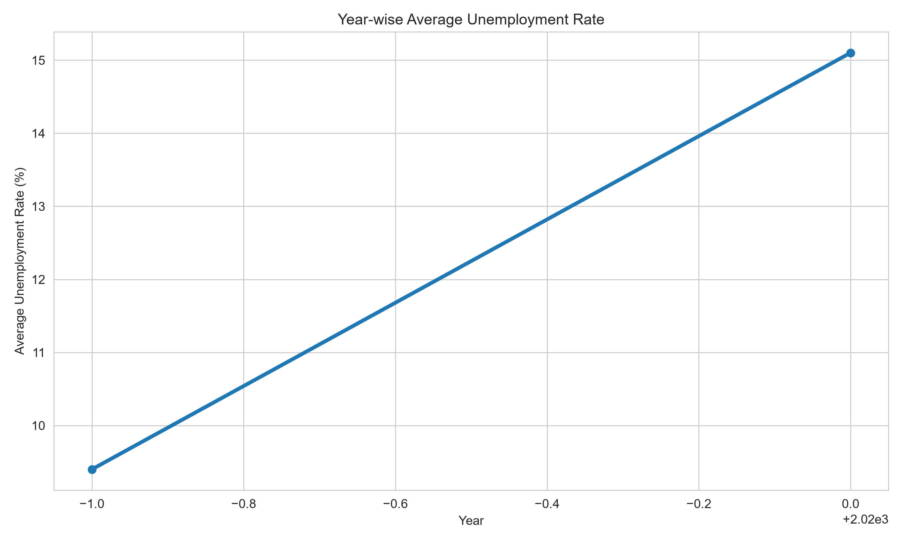

---

## Workflow Diagram

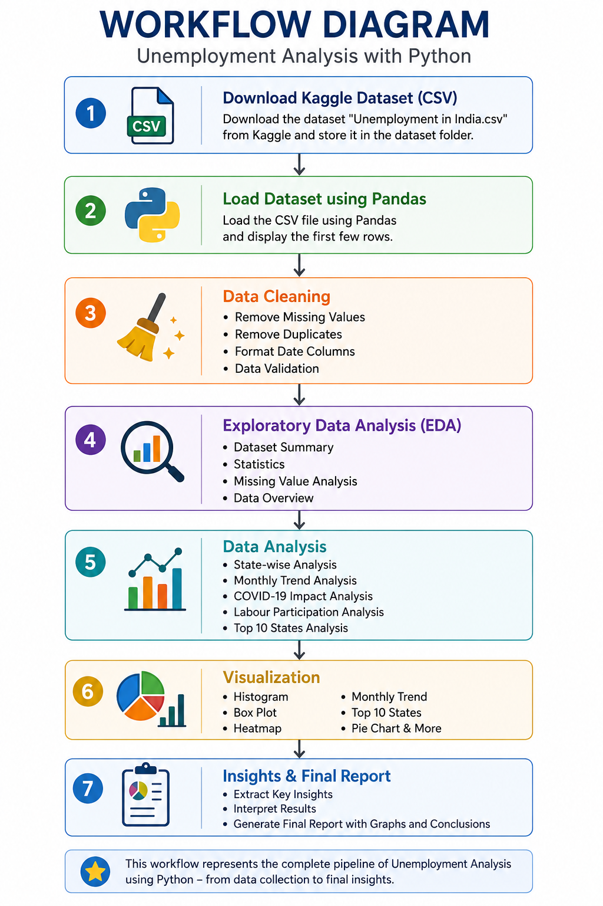

---

## System Architecture

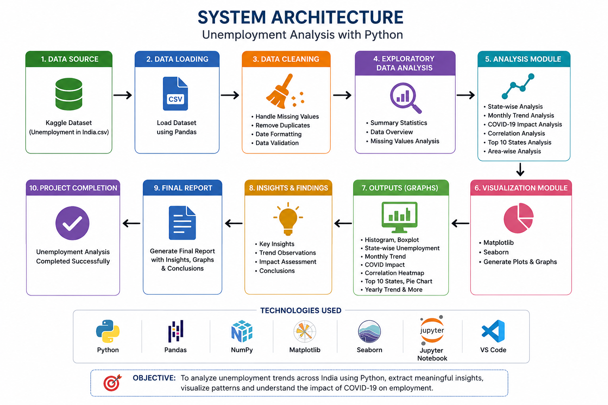

---

## Prediction / Analysis Output

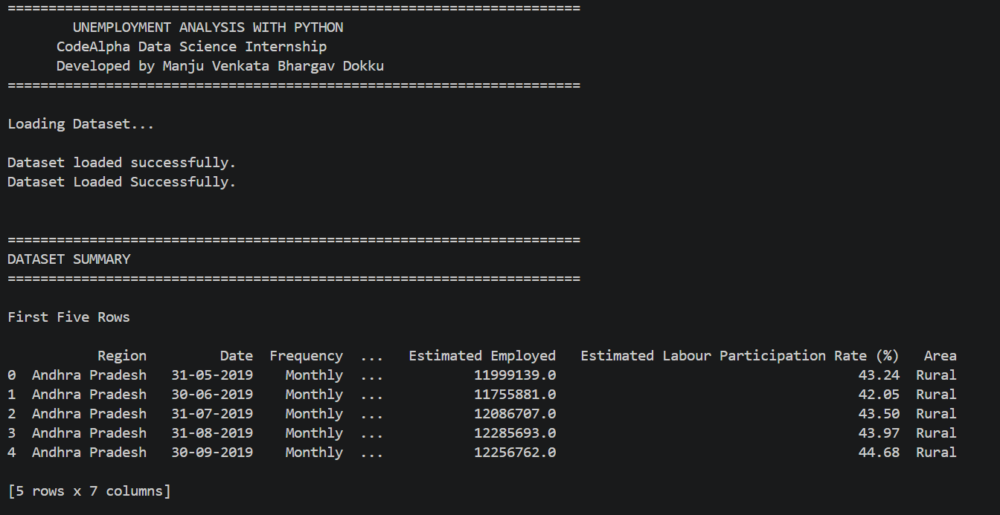

---

## Terminal Output


---

# Key Insights

- Unemployment rates differ significantly across Indian states.
- COVID-19 had a substantial impact on unemployment levels during 2020.
- Certain states consistently experienced higher unemployment rates than others.
- Monthly analysis highlights seasonal fluctuations in employment.
- Labour participation rates vary considerably between regions.
- Data visualization makes it easier to identify employment patterns and regional disparities.

---

# Future Enhancements

- Interactive Dashboard using Streamlit
- Time Series Forecasting using ARIMA
- Deep Learning Forecasting using LSTM
- Real-time Government Data Integration
- Power BI Dashboard
- Deployment on Streamlit Cloud
- Automated Report Generation

---

# Learning Outcomes

Through this project, you will learn:

- Data Cleaning
- Data Preprocessing
- Exploratory Data Analysis (EDA)
- Data Visualization
- Statistical Analysis
- Correlation Analysis
- Python for Data Analysis
- Pandas & NumPy
- Matplotlib & Seaborn
- Git & GitHub Project Management

---

# Contributing

Contributions are welcome.

1. Fork the repository.
2. Create a new branch.
3. Make your changes.
4. Commit your changes.
5. Submit a Pull Request.

---

# Author

**Manju Venkata Bhargav Dokku**

**CodeAlpha Data Science Intern**

GitHub: https://github.com/ManjuVenkataBhargavDokku

---

# License

This project is licensed under the **MIT License**.

---

# If you found this project helpful, please consider giving it a star on GitHub!